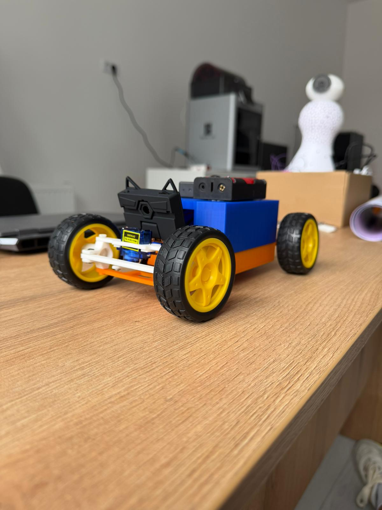
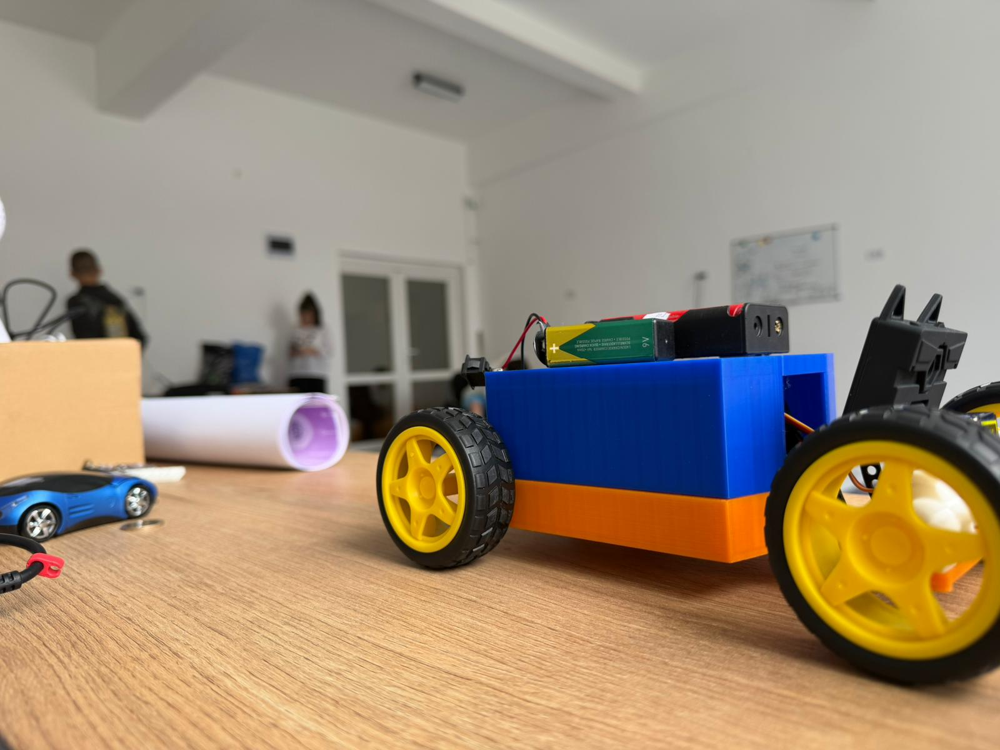
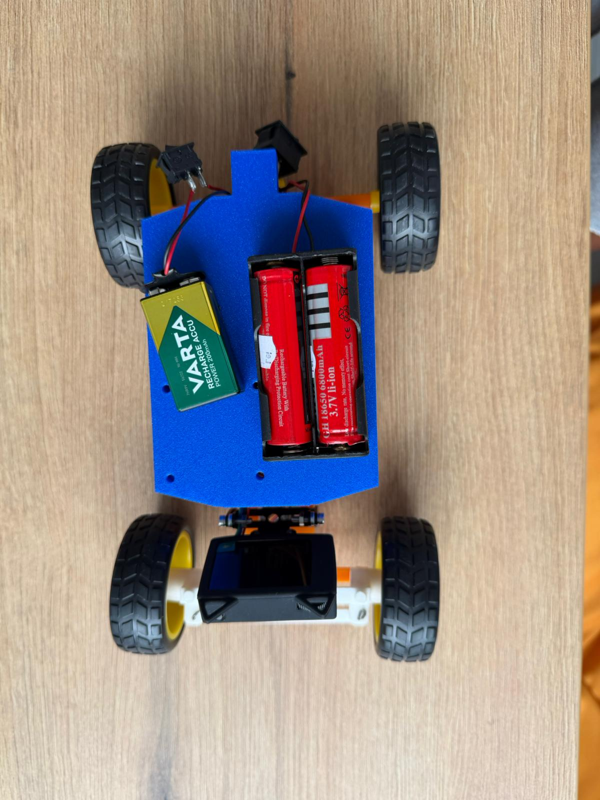

# 🏎️ WRO 2026 Future Engineers – Team StormDrive: Technical Documentation

## 🌍 Overview & Journey
**StormDrive** is a competitive robotics team participating in the **WRO Future Engineers (14–22 years)** category for the 2026 season. Our mission is to design, build, and program a fully autonomous vehicle capable of dynamic environment navigation, colour-based obstacle avoidance, and precision parallel parking. 

Our development process strictly follows the engineering cycle: **design → prototype → test → evaluate → refine**. We completed 4 major chassis iterations, each addressing specific mechanical or electronic failures identified during structured testing sessions. Our core electronic platform remained consistent across all iterations to reduce cost and allow software continuity.

💡 **Design Philosophy:** A robust mechanical foundation is the prerequisite for reliable software execution. No algorithmic tuning can compensate for a structurally unstable chassis.

---

## 📚 Table of Contents
* [👥 The Team](#-the-team)
* [🎯 Challenge Overview](#-challenge-overview)
* [🤖 Vehicle Design and Evolution](#-vehicle-design-and-evolution)
* [📂 Repository Structure](#-repository-structure)
* [⚙️ Mobility Management](#-mobility-management)
* [🛠️ Power and Sense Management](#-power-and-sense-management)
* [💻 Software Architecture](#-software-architecture)
* [📝 Obstacle Management Strategy](#-obstacle-management-strategy)
* [🅿️ Parking Strategy](#-parking-strategy)
* [🔧 Engineering Challenges and Solutions](#-engineering-challenges-and-solutions)
* [📊 Testing Methodology and Quality Assurance](#-testing-methodology-and-quality-assurance)
* [⚠️ Risk Management and Mitigation](#-risk-management-and-mitigation)
* [📽️ Performance Videos](#-performance-videos)
* [💰 Cost Analysis](#-cost-analysis)
* [🏁 Conclusion and Future Work](#-conclusion-and-future-work)
* [📜 License](#-license)

---

### 👥 The Team
| Mario | Isabella | Robert |
| :--- | :--- | :--- |
|  |  |  |
| **Barladianu Mario-Gabriel** | **Guzu Isabella Elena** | **Dascalu Robert Marian** |
| Lead Developer | Software Research | Hardware Specialist |

---

## 🎯 Challenge Overview
The WRO Future Engineers category requires teams to design a self-driving vehicle that navigates a dynamic, unpredictable track fully autonomously using sensors and control algorithms.

### Competition Rules & Design Constraints
1. **Dimensions:** Vehicle must fit within 300 × 200 × 300 mm.
2. **Steering:** Must use Ackermann-type steering (Rule 11.3). Differential drive is explicitly prohibited.
3. **Autonomy:** No wireless communication during the run; start button and single power switch required.

---

## 🤖 Vehicle Design and Evolution
We went through 4 chassis iterations, systematically solving mechanical bottlenecks.

| View | Photo | Description |
| :--- | :---: | :--- |
| **FRONT** |  | Ackermann steering axle, 80mm height HuskyLens mount. |
| **BACK** |  | Rear-drive configuration, 7.4V battery placement. |
| **LEFT** |  | Mechanical linkage for steering and power routing. |
| **RIGHT** |  | Start button ergonomics and weight distribution. |
| **TOP** |  | Arduino Uno and L298N motor driver positioning. |
| **BOTTOM** |  | Drive gear mesh and ground clearance verification. |

**Iteration History:**
* **V1:** Custom laser-cut chassis; too flexible.
* **V2:** Reinforced mounts; still had motor-chassis incompatibility.
* **V3:** Redesigned motor brackets; gear misalignment caused 30% power loss.
* **V4 (Final):** Adopted open-source Thingiverse #6667669; compliant, rigid, and reproducible.

---

## 📂 Repository Structure
* `/src/main.ino`: The central state-machine logic.
* `/src/config.h`: Centralized tuning parameters (speeds, angles, thresholds).
* `/schemes/`: Electrical CAD drawings and power distribution maps.
* `/mechanical/`: STL files for 3D printed components.
* `/media/`: Visual assets and demonstration videos.

---

## ⚙️ Mobility Management
Our vehicle uses **Ackermann steering geometry** with a rear-wheel drive layout. We chose this configuration to ensure that the inner and outer wheels follow concentric circles, reducing tire scrub and improving cornering precision on tight WRO sections.

---

## 🛠️ Power and Sense Management
* **Power:** 2× 18650 Li-ion cells in series (7.4V nominal). 
* **Sensor:** DFRobot HuskyLens. Selected for its onboard FPGA, which offloads the vision-processing overhead from the Arduino. It provides 30Hz structured object detection.

---

## 💻 Software Architecture
The software is a **9-state finite machine**.
1. **Init:** Setup of I2C and Servo.
2. **Drive:** Normal path navigation.
3. **Avoidance:** Reactive steering for Red/Green pillars.
4. **Cornering:** Detection of Blue/Orange lines.
5. **Parking Search:** Slow cruise looking for Magenta markers.
6. **Pass Lot:** Positioning before reversing.
7. **Reverse Sweep:** 2-phase parking movement.
8. **Final Correction:** Alignment.
9. **Stop:** Safe mode.

---

## 📝 Obstacle Management Strategy
We use an **Area-Based Detection Threshold (1/50 of frame area)**. A pillar must occupy at least 2% of the frame before the robot executes an avoidance maneuver. This prevents false positive detections of distant obstacles.

---

## 🅿️ Parking Strategy
Parking is triggered after `TOTAL_COLTURI = 12`. Upon detecting the Magenta marker, the robot enters a state-based reverse sweep (Pass Phase -> Reverse Sweep 1 -> Reverse Sweep 2 -> Correction).

---

## 🔧 Engineering Challenges and Solutions
| Challenge | Impact | Resolution |
| :--- | :--- | :--- |
| **Tire Traction** | Sliding | Switched to silicone slick tires; 75% slip reduction. |
| **Motor Mounting** | Gear misalignment | Migrated to Thingiverse V4 design. |
| **Brownouts** | Random system resets | Upgraded to 7.4V 2S 18650 power rail. |
| **Steering Conflict** | Corner vs. Pillar | Implemented 3 tiers of steering angles in code. |
| **False Lap Triggers** | Double detections | Added 1250ms suppression window. |

---

## 📊 Testing Methodology
We implemented a **3-Tier Testing Protocol**: 1. Component Testing, 2. Integration Testing, 3. Field Testing (100+ laps to collect performance data).

---

## ⚠️ Risk Management
* **Sensor Noise:** Mitigated by keeping I2C wires under 15cm.
* **Battery Failure:** Hardware power switch per Rule 9.10.
* **Software Hangs:** Used `huskyOK` flag to auto-reconnect the vision sensor.

---

## 📽️ Performance Videos
[**Watch our StormDrive Robot in Action!**](https://youtu.be/e42kXT7T-QY)

---

## 💰 Cost Analysis
| Component | Qty | Cost (EUR) | Justification |
| :--- | :---: | :--- | :--- |
| HuskyLens | 1 | 50 | Vision processing. |
| Arduino Uno | 1 | 15 | Robust controller. |
| L298N Driver | 1 | 5 | H-bridge driver. |
| Motors | 2 | 10 | High-torque. |
| Batteries | 2 | 6 | Energy source. |
| Chassis/Hardware | 1 | 40 | Custom frame. |
| **Total** | | **126 EUR** | Optimized. |

---

## 🏁 Conclusion and Future Work
The development of StormDrive was a rigorous exercise in optimization. Future work includes MPU-6050 IMU integration and PID steering control for dynamic corridor widths.

---

## 📜 License
This project is licensed under the **MIT License**.

---

### Technical Deep-Dive: Code Modularization
By separating **Constants** (`config.h`) from **Logic** (`main.ino`), we streamlined calibration. If track conditions demand speed changes, we only modify `config.h`, ensuring the complex 9-state machine logic remains untouched and reliable.
