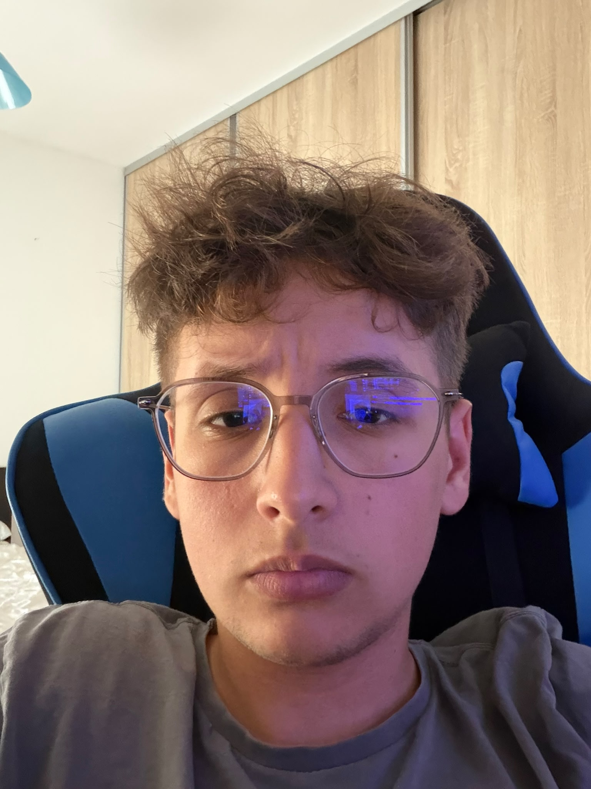
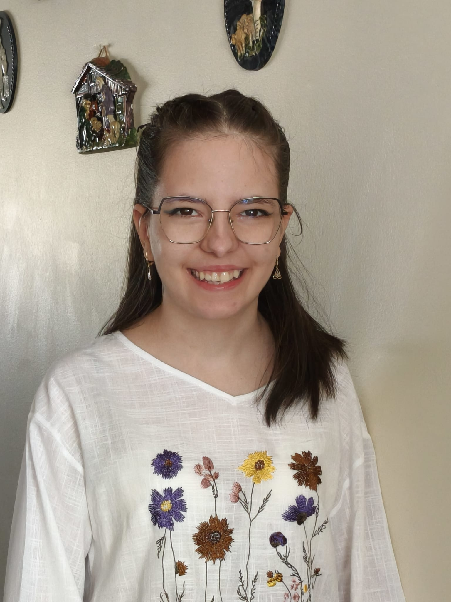
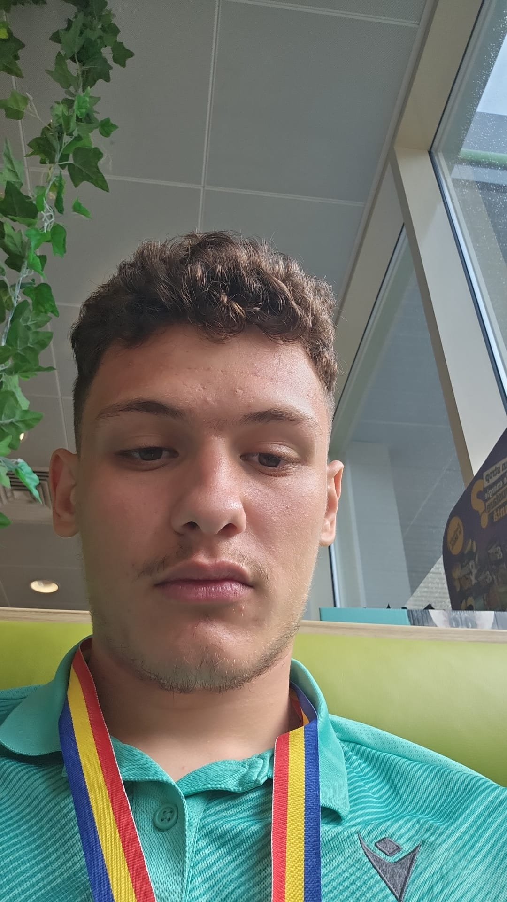
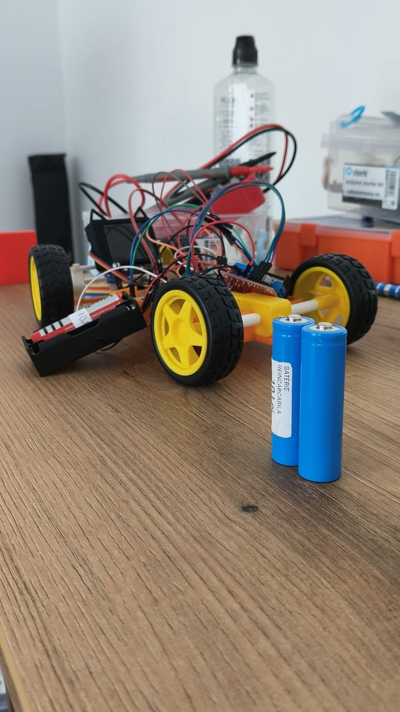
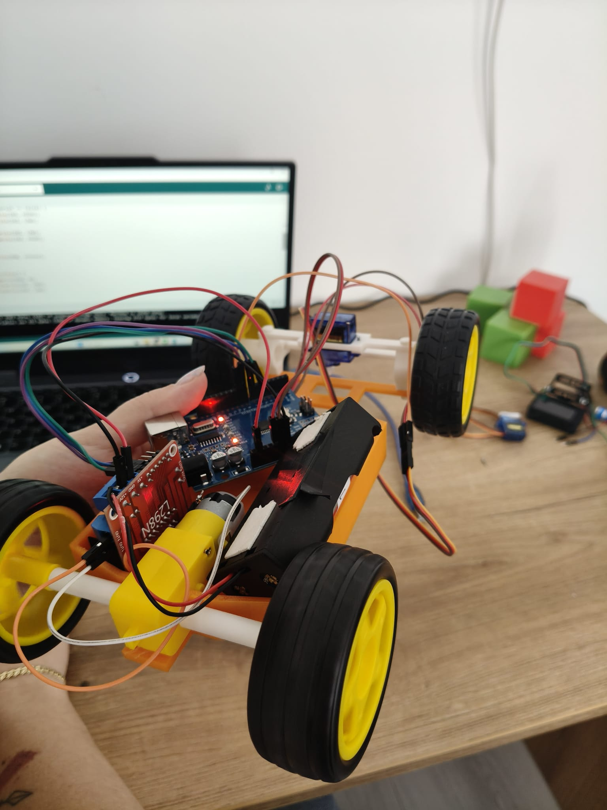

# 🏎️ WRO 2026 Future Engineers – StormDrive Team

## 🌍 Overview & Journey
**StormDrive** is a competitive robotics team participating in the **Future Engineers (14-22 years)** category at the World Robot Olympiad (WRO) 2026. Our mission is to design, build, and program a fully autonomous vehicle capable of dynamic environment navigation, color-based obstacle avoidance, and precision parallel parking.

Our entire development process follows an authentic engineering cycle. We went through **4 major chassis iterations** to fix issues with dimensions and power transmission, while keeping our core electronic platform consistent and cost-effective by reusing our main components across all prototypes.

---

## 📚 Table of Contents
* [👥 The Team](#-the-team)
* [🎯 Challenge Overview](#-challenge-overview)
* [🤖 Our Robot & Design Evolution](#-our-robot--design-evolution)
* [📂 Folder Structure](#-folder-structure)
* [⚙️ Mobility Management](#%EF%B8%8F-mobility-management)
  * [🚗 Drivebase & Drivetrain](#-drivebase--drivetrain)
  * [⚙️ Motors & Powertrain](#%EF%B8%8F-motors--powertrain)
  * [🛞 Wheels & Tires](#-wheels--tires)
* [🛠️ Power and Sense Management](#%EF%B8%8F-power-and-sense-management)
  * [🔋 Components List](#-components-list)
  * [🔌 Motor Driver Integration](#-motor-driver-integration)
* [💻 Components Coding](#-components-coding)
* [📝 Obstacle Management & Strategy](#-obstacle-management--strategy)
* [📽️ Performance Video](#%EF%B8%8F-performance-video)
* [💰 Cost Analysis](#-cost-analysis)
* [📜 License](#-license)

---

### 👥 The Team

| Mario | Isabella | Robert |
| :---: | :---: | :---: |
|  |  |  |
| **Barladianu Mario-Gabriel** <br> Lead Developer | **Guzu Isabella Elena** <br> Software Research | **Dascalu Robert Marian** <br> Hardware Specialist |

### 👩‍🏫 Mentor / Coach
* **Name:** Rădulescu Ramona
* **Contact:** radramra@gmail.com
* **Role:** Team coordination, resource management, and strategic logistical support throughout the development phase.

### 🧠 Team Members

#### Barladianu Mario-Gabriel
* **Age:** 16
* **Role:** Lead Developer & System Integrator
* **Description:** Responsible for the software architecture, core control algorithms, and overall system integration. He focused on implementing the programming logic on the Arduino platform and sensory processing systems to ensure optimal autonomous execution.

#### Guzu Isabella Elena
* **Age:** 17
* **Role:** Software Research & Strategic Planning
* **Description:** Specializes in algorithmic research, data validation, and strategic planning. She contributed significantly to testing various codebase solutions, optimizing logic parameters, and managing the technical documentation required for the competition.

#### Dascalu Robert Marian
* **Age:** 17
* **Role:** Mechanical Engineering & Hardware Specialist
* **Description:** Focuses on the structural integrity and physical reliability of the vehicle. He was responsible for the precision chassis assembly, strategic component fastening (screws, nuts), and rigorous wire management to prevent any hardware disruptions on the track.

---

## 🎯 Challenge Overview
The **WRO Future Engineers** category challenges teams to design a self-driving vehicle that can navigate an unpredictable, dynamic track using sensors and advanced control loops.

### 📌 Competition Format
* **🏁 Open Challenge:** The vehicle must successfully complete 3 consecutive laps on a track where the inner walls randomly shift position between rounds.
* **🚦 Obstacle Challenge:** The vehicle navigates the 3 laps while actively avoiding colored pillars placed randomly on the track:
  * 🟥 **Red Pillars:** Must be bypassed on the **right** side.
  * 🟩 **Green Pillars:** Must be bypassed on the **left** side.
* **🅿️ Parking:** Upon completing the final lap, the vehicle must autonomously detect a designated parking zone and execute a perfect reverse parallel parking maneuver.

---

## 🤖 Our Robot & Design Evolution

The final design we are competing with is the result of **4 major chassis iterations**, solving issues related to power transmission, motor compatibility, and strict WRO dimensional constraints.

### 📐 The Iteration Process
1. **Prototype V1 (The Drivetrain Issue):** Our initial design suffered from poor power transmission between the motor and the drive wheels, leading to high friction and inefficient energy consumption.
2. **Prototype V2 (Regulation & Length Failure):** While trying to fix the motor mounts, the vehicle's overall length exceeded the maximum limits allowed by the WRO rules.
3. **Prototype V3 (Chassis-Motor Mismatch):** We attempted to scale down the design to fix the length violations, but the motor form-factor did not align properly with the structural mounts, causing mechanical stress.
4. **Prototype V4 (Current - Optimized & Compliant):** To establish a reliable baseline, we transitioned to a proven, robust open-source mechanical platform via [Thingiverse (Thing: 6667669)](https://www.thingiverse.com/thing:6667669). We adapted and calibrated this design to fix all previous powertrain issues while ensuring 100% compliance with WRO dimensional guidelines.

| Front View | Rear View | Bottom View |
| :---: | :---: | :---: |
|  |  | 

---

## 📂 Folder Structure
```text
├── README.md                  <- Main documentation file
├── src/                       <- Complete vehicle source code
│   ├── main.ino               <- Main Arduino execution loop
│   └── config.h               <- Pin definitions and tuning constants
├── schematics/                <- Electrical and power distribution diagrams
│   └── wiring_diagram.png     <- Full hardware wiring connection schema
├── mechanical/                <- 3D printing and hardware manufacturing files
│   └── chassis_v4_modified.stl<- Adapted Thingiverse mechanical platform
└── media/                     <- Mandatory team and robot visual assets
    ├── team-photos/
    │   ├── mario.jpg
    │   ├── isabella.jpg
    │   └── robert.jpg
    └── robot-photos/
        ├── front.jpg
        └── back.jpg
