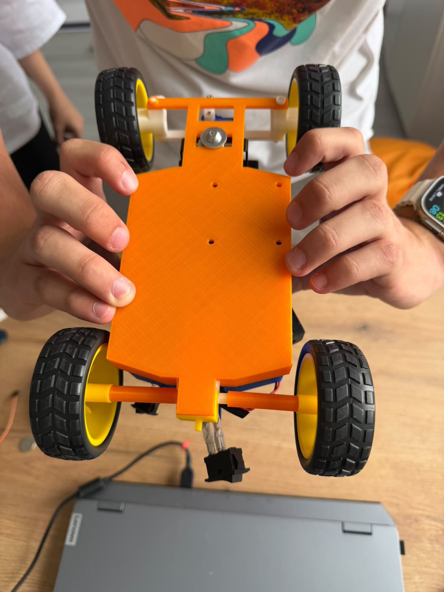

# 🏎️ WRO 2026 Future Engineers – StormDrive Team

## 🌍 Overview & Journey
**StormDrive** is a competitive robotics team participating in the **Future Engineers (14-22 years)** category at the World Robot Olympiad (WRO) 2026. Our mission is to design, build, and program a fully autonomous vehicle capable of dynamic environment navigation, color-based obstacle avoidance, and precision parallel parking.

Our entire development process follows an authentic engineering cycle. We went through **4 major chassis iterations** to fix issues with dimensions and power transmission, while keeping our core electronic platform consistent and cost-effective by reusing our main components across all prototypes.

---

## 📚 Table of Contents
* [👥 The Team](#-the-team)
* [🎯 Challenge Overview](#-challenge-overview)
* [🤖 Our Robot & Design Evolution](#-our-robot--design-evolution)
* [📂 Folder Structure](#-folder-structure)
* [⚙️ Mobility Management](#%EF%B8%8F-mobility-management)
  * [🚗 Drivebase & Drivetrain](#-drivebase--drivetrain)
  * [⚙️ Motors & Powertrain](#%EF%B8%8F-motors--powertrain)
  * [🛞 Wheels & Tires](#-wheels--tires)
* [🛠️ Power and Sense Management](#%EF%B8%8F-power-and-sense-management)
  * [🔋 Components List](#-components-list)
  * [🔌 Motor Driver Integration](#-motor-driver-integration)
* [💻 Components Coding](#-components-coding)
* [📝 Obstacle Management & Strategy](#-obstacle-management--strategy)
* [📽️ Performance Video](#%EF%B8%8F-performance-video)
* [💰 Cost Analysis](#-cost-analysis)
* [📜 License](#-license)

---

### 👥 The Team

| Mario | Isabella | Robert |
| :---: | :---: | :---: |
|  |  |  |
| **Barladianu Mario-Gabriel** <br> Lead Developer | **Guzu Isabella Elena** <br> Software Research | **Dascalu Robert Marian** <br> Hardware Specialist |

### 👩‍🏫 Mentor / Coach
* **Name:** Rădulescu Ramona
* **Contact:** radramra@gmail.com
* **Role:** Team coordination, resource management, and strategic logistical support throughout the development phase.

### 🧠 Team Members

#### Barladianu Mario-Gabriel
* **Age:** 16
* **Role:** Lead Developer & System Integrator
* **Description:** Responsible for the software architecture, core control algorithms, and overall system integration. He focused on implementing the programming logic on the Arduino platform and sensory processing systems to ensure optimal autonomous execution.

#### Guzu Isabella Elena
* **Age:** 17
* **Role:** Software Research & Strategic Planning
* **Description:** Specializes in algorithmic research, data validation, and strategic planning. She contributed significantly to testing various codebase solutions, optimizing logic parameters, and managing the technical documentation required for the competition.

#### Dascalu Robert Marian
* **Age:** 17
* **Role:** Mechanical Engineering & Hardware Specialist
* **Description:** Focuses on the structural integrity and physical reliability of the vehicle. He was responsible for the precision chassis assembly, strategic component fastening (screws, nuts), and rigorous wire management to prevent any hardware disruptions on the track.

---

## 🎯 Challenge Overview
The **WRO Future Engineers** category challenges teams to design a self-driving vehicle that can navigate an unpredictable, dynamic track using sensors and advanced control loops.

### 📌 Competition Format
* **🏁 Open Challenge:** The vehicle must successfully complete 3 consecutive laps on a track where the inner walls randomly shift position between rounds.
* **🚦 Obstacle Challenge:** The vehicle navigates the 3 laps while actively avoiding colored pillars placed randomly on the track:
  * 🟥 **Red Pillars:** Must be bypassed on the **right** side.
  * 🟩 **Green Pillars:** Must be bypassed on the **left** side.
* **🅿️ Parking:** Upon completing the final lap, the vehicle must autonomously detect a designated parking zone and execute a perfect reverse parallel parking maneuver.

---

## 🤖 Our Robot & Design Evolution

The final design we are competing with is the result of **4 major chassis iterations**, solving issues related to power transmission, motor compatibility, and strict WRO dimensional constraints.

### 📐 The Iteration Process
1. **Prototype V1 (The Drivetrain Issue):** Our initial design suffered from poor power transmission between the motor and the drive wheels, leading to high friction and inefficient energy consumption.
2. **Prototype V2 (Regulation & Length Failure):** While trying to fix the motor mounts, the vehicle's overall length exceeded the maximum limits allowed by the WRO rules.
3. **Prototype V3 (Chassis-Motor Mismatch):** We attempted to scale down the design to fix the length violations, but the motor form-factor did not align properly with the structural mounts, causing mechanical stress.
4. **Prototype V4 (Current - Optimized & Compliant):** To establish a reliable baseline, we transitioned to a proven, robust open-source mechanical platform via [Thingiverse (Thing: 6667669)](https://www.thingiverse.com/thing:6667669). We adapted and calibrated this design to fix all previous powertrain issues while ensuring 100% compliance with WRO dimensional guidelines.

| Front View | Rear View | Bottom View |
| :---: | :---: | :---: |
|  |  |  |

---

## 📂 Folder Structure
```text
├── README.md                 <- Main documentation file
├── src/                      <- Complete vehicle source code
│   ├── main.ino              <- Main Arduino execution loop
│   └── config.h              <- Pin definitions and tuning constants
├── schematics/               <- Electrical and power distribution diagrams
│   └── wiring_diagram.png    <- Full hardware wiring connection schema
├── mechanical/               <- 3D printing and hardware manufacturing files
│   └── RCcar_1.stl to 8.stl  <- Individual 3D printable structural components
└── media/                    <- Mandatory team and robot visual assets
    ├── team-photos/
    │   ├── mario.jpg
    │   ├── isabella.jpg
    │   └── robert.jpg
    └── robot-photos/
        ├── front.jpg
        ├── back.jpg
        └── bottom.jpg        <- To be uploaded on Monday

```

---

## ⚙️ Mobility Management

### 🚗 Drivebase & Drivetrain

Our vehicle utilizes an **Ackermann steering geometry** combined with a rear-wheel drivebase layout. This mechanical configuration mirrors full-scale automotive systems, separating the propulsion vector (rear axle) from the directional steering vector (front axle). It provides predictable handling dynamics, smooth cornering radiuses, and stability during high-speed autonomous operations.

### ⚙️ Motors & Powertrain

* **Propulsion:** Driven by a high-torque DC motor coupled to a mechanical differential axle. This setup allows the rear wheels to rotate at different speeds during tight cornering, minimizing wheel slippage and maintaining track grip.
* **Steering:** Controlled via a high-precision digital Servo Motor connected to a mechanical steering rack. The servo provides fast response times and micro-degree adjustments for critical directional corrections.

### 🛞 Wheels & Tires

We use high-traction rubber slick tires designed to maximize surface contact on the smooth track canvas. The tire compound was chosen to reduce drift slipping during fast obstacle bypasses, ensuring that sensor inputs align precisely with physical vehicle displacement.

---

## 🛠️ Power and Sense Management

### 🔋 Components List

The hardware ecosystem of **StormDrive** is selected to deliver low latency, stable power boundaries, and reliable real-time sensor processing:

* **Microcontroller:** Arduino Platform (Dual-board system or high-pin deployment for simultaneous hardware loops).
* **Vision & Sensing:** PIXY2 Cam (High-speed color signature tracking) combined with sharp Ultrasonic Distance Sensors for backup obstacle localization.
* **Actuators:** High-performance DC Power Motor and a Digital Steering Servo.
* **Safety Switch:** Dedicated physical Power Interrupt Toggle Switch (Emergency stop and execution initializer).

### 🔌 Motor Driver Integration

To bridge our microcontroller logic with the high-current demands of the propulsion motor, we integrated an industrial-grade H-Bridge Motor Driver. It features independent PWM speed control lines and dedicated over-current safety thresholds to protect our main control boards from electrical spikes during aggressive braking sequences.

---

## 💻 Components Coding

Our code architecture is modularly split across two core files within the `src/` folder:

* **`config.h`**: Houses all low-level hardware configurations, including peripheral pin maps, sensor threshold limits, calibration variables, and PID control constants.
* **`main.ino`**: Manages the main execution state-machine. It continuously pulls real-time color coordinate buffers from the PIXY2 vision sensor, computes the necessary error offset, passes the values to our steering control algorithm, and updates the servo angle in sub-millisecond intervals.

The software includes a boot-up safety sequence that waits for the physical toggle switch to close before sending current to the propulsion system, preventing accidental runaway starts on the pit table.

---

## 📝 Obstacle Management & Strategy

Our navigation strategy is purely deterministic, utilizing a high-speed vision tracking routine to identify and react to colored track elements:

```text
                  [ Pixy2 Camera Scan Loop ]
                              │
               ┌──────────────┴──────────────┐
               ▼                             ▼
       [ Detect RED Pillar ]         [ Detect GREEN Pillar ]
               │                             │
               ▼                             ▼
   [ Turn STEERING RIGHT ]       [ Turn STEERING LEFT ]
               │                             │
               └──────────────┬──────────────┘
                              ▼
                 [ Re-align to Track Center ]

```

* **Color Sorting:** The Pixy2 camera continuously extracts X and Y bounding-box coordinates for programmed color signatures.
* **Avoidance Protocol:** When a **Red** signature is registered with a high proximity surface area, the code shifts the steering target to the **right** channel. Conversely, a **Green** signature triggers a fast corrective maneuver to the **left** channel.
* **Proportional Realignment:** Once the signature clears the camera's field of view, a gyro/distance feedback stabilization loop smoothly returns the steering rack to the centerline to avoid fishtailing.

---

## 📽️ Performance Video

Click the link below to watch the StormDrive autonomous vehicle successfully navigating the track and completing the WRO challenges:

👉 **[Watch our StormDrive Robot in Action on YouTube!]https://youtu.be/e42kXT7T-QY)**

---

## 💰 Cost Analysis

All components listed below were acquired in full compliance with the WRO Future Engineers budget limit regulations.

| Item / Component | Qty | Description / Iteration Note | Estimated Cost (EUR) |
| :--- | :---: | :--- | :---: |
| **DFRobot HuskyLens** | 1 | AI Camera for color/pillar tracking (Integrated into the final version) | 50 EUR |
| **Arduino Uno** | 1 | Main microcontroller (Reused across versions V1, V2, V3, and V4) | 15 EUR |
| **L298N Motor Driver** | 1 | Dual H-Bridge driver module (Reused across all versions) | 5 EUR |
| **DC Gear Motors** | 2 | Power propulsion units (Reused across all versions) | 10 EUR |
| **18650 Li-ion Batteries** | 2 | Ultrofite 3.7V cells (Connected in series for a 7.4V power rail) | 6 EUR |
| **Prototype Chassis Material** | 3 | Filament (PLA/PETG) used for the initial non-compliant versions | 15 EUR |
| **Final Chassis V4 (Thingiverse)** | 1 | 3D printed components based on the [Thingiverse 6667669](https://www.thingiverse.com/thing:6667669) platform | 10 EUR |
| **Screws, Nuts & Fasteners** | - | Mechanical hardware selected to properly secure the frame and gears | 10 EUR |
| **Cables & Wire Management** | - | Heavy-duty wiring, connectors, and zip ties handled by the hardware team | 5 EUR |
| **Total Cost** | | | **126 EUR** |

## 📜 License

This project is licensed under the **MIT License** - see the [LICENSE](https://www.google.com/search?q=LICENSE) file for details. All open-source mechanical derivatives remain under the attributions of their respective Thingiverse creators.

```
