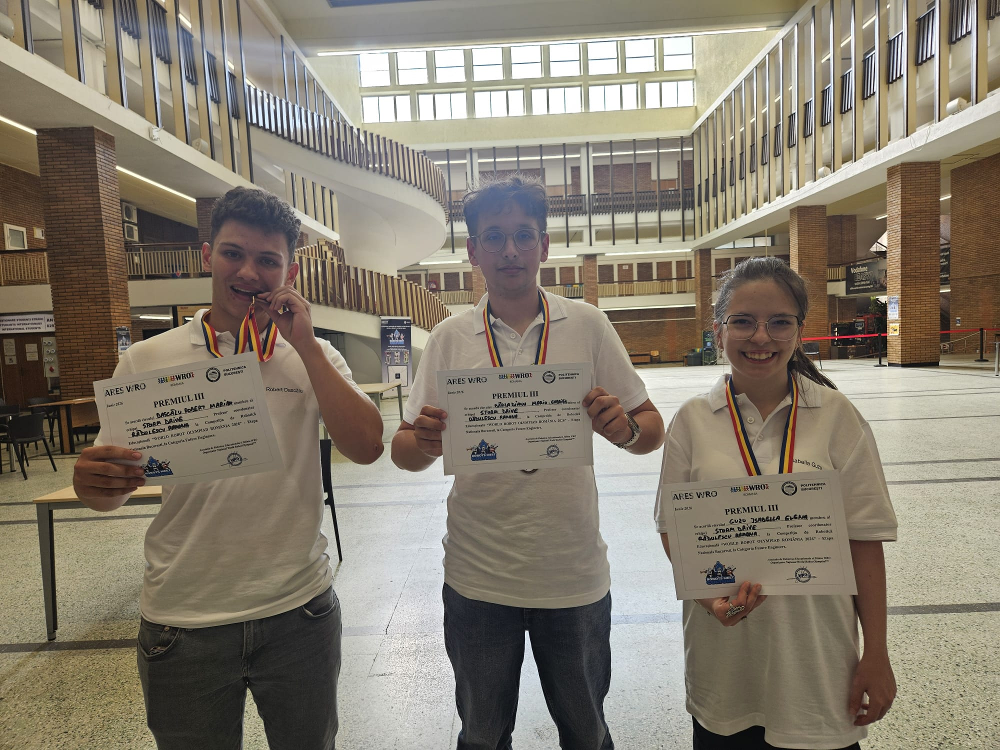
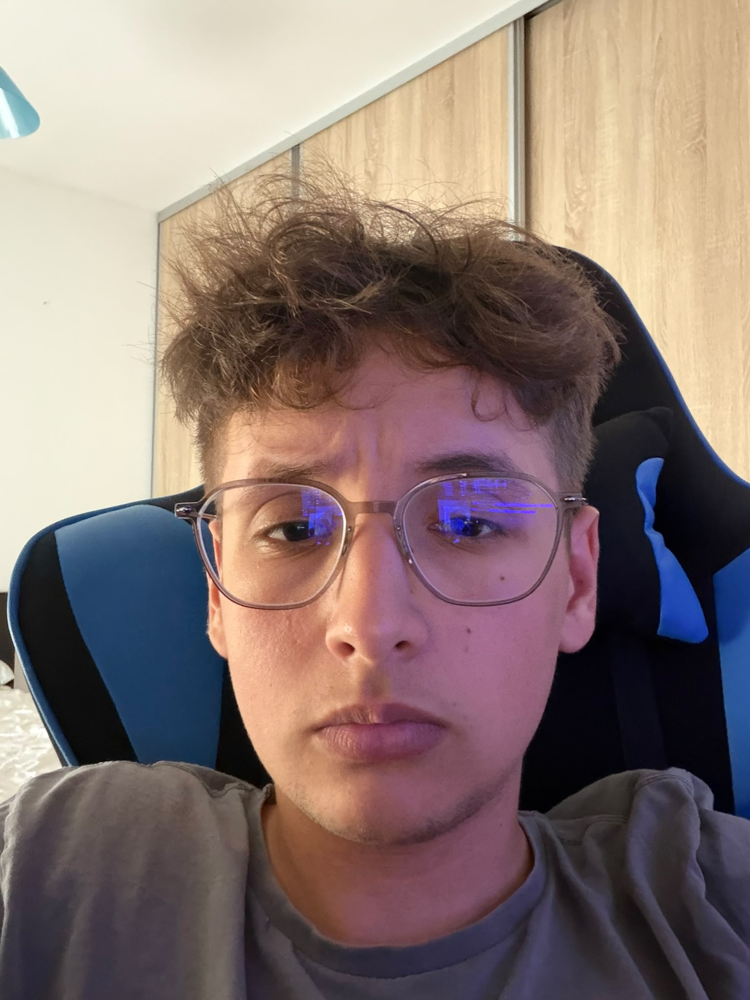
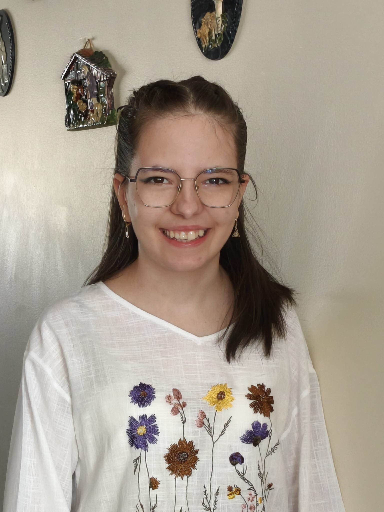
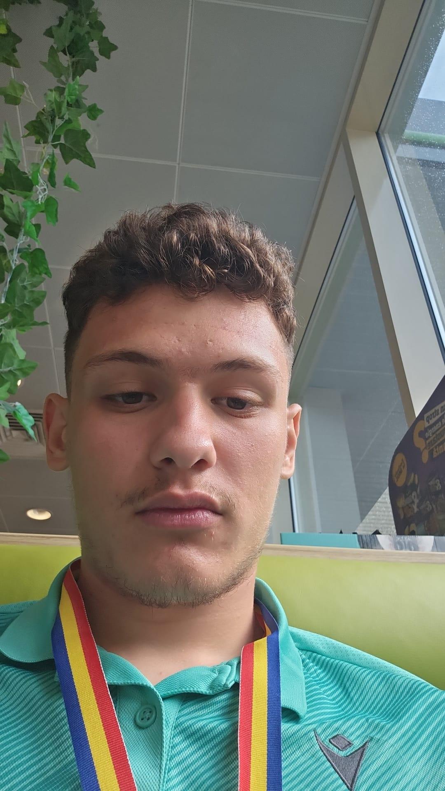

# 🏎️ StormDrive

### WRO 2026 · Future Engineers

<p align="center">
  
</p>

<p align="center">
  <strong>🥉 3rd Place · WRO Romania 2026</strong><br>
  <strong>🇪🇺 Road to the European Championship</strong>
</p>

<p align="center">
  <em>From our first competition platform to a completely new generation of StormDrive.</em>
</p>

---

## 🌍 About StormDrive

**StormDrive** is our robotics project for the **WRO Future Engineers 2026** season.

We design, build, program and test an autonomous vehicle for dynamic track navigation. The project combines mechanical design, electronics, embedded programming, computer vision, control logic and continuous physical testing.

Our work is organized around a simple engineering cycle:

> **Design → Build → Test → Measure → Improve**

This repository documents that process — including the successful parts, the problems we encountered, the decisions we changed, and the evolution from our original **V1** platform to the new **V2** platform developed for the European stage.

---

## 🥉 WRO Romania 2026

Our 2026 season started with the Romanian stage of WRO Future Engineers, where **StormDrive finished in 3rd place**.

The competition gave us practical experience with autonomous driving, track interpretation, mechanical reliability, software tuning and the pressure of running a robot repeatedly in a competition environment.

That experience also showed us where our original platform could be improved. Instead of continuing with increasingly complex modifications to V1, we chose to use the lessons from the national stage as the starting point for a new platform.

### 📸 The team at the Romanian Championship

<p align="center">
  
</p>

---

# 👥 Meet the Team

<table>
  <tr>
    <td align="center">
      <br>
      <strong>Mario Barladianu</strong><br>
      Lead Developer
    </td>
    <td align="center">
      <br>
      <strong>Isabella Guzu</strong><br>
      Software Research
    </td>
    <td align="center">
      <br>
      <strong>Robert Dascalu</strong><br>
      Hardware Specialist
    </td>
  </tr>
</table>

### 👨‍💻 Mario Barladianu
**Lead Developer** — responsible for the main software development, control logic, integration and programming workflow.

### 🧠 Isabella Guzu
**Software Research** — focuses on software research, testing ideas and helping evaluate approaches for autonomous navigation.

### 🔧 Robert Dascalu
**Hardware Specialist** — focuses on mechanical construction, electronics, physical integration and hardware testing.

> StormDrive is a team project. Mechanical, software and testing decisions are developed collaboratively throughout the season.

---

# 🇪🇺 Road to Europe

After the Romanian Championship, we decided to take a different engineering approach for the European stage.

Our original vehicle had already gone through several mechanical iterations. The national competition gave us valuable information about what worked and what limited consistency in real competition conditions.

Rather than continuing to add modifications to the existing platform, we started **StormDrive V2** as a new platform.

```text
┌──────────────────────┐
│    StormDrive V1     │
│ Original platform    │
└──────────┬───────────┘
           │
           ▼
┌──────────────────────┐
│  🇷🇴 WRO Romania     │
│      2026             │
│     🥉 3rd Place      │
└──────────┬───────────┘
           │
           ▼
┌──────────────────────┐
│   Lessons learned    │
│   + redesign         │
└──────────┬───────────┘
           │
           ▼
┌──────────────────────┐
│    StormDrive V2     │
│ New vehicle platform │
└──────────┬───────────┘
           │
           ▼
┌──────────────────────┐
│  🇪🇺 European Stage  │
└──────────────────────┘
```

**V2 is not simply an upgraded V1. It is a new engineering iteration built from the experience gained with V1.**

---

# 🤖 StormDrive V2 — Current Platform

The European-stage platform is currently based on an **Adeept PiCar-B Mars Rover Kit** with a **Raspberry Pi** as the main computing platform.

We are currently using the components supplied with the platform and are testing the vehicle before deciding whether additional sensors or the previous HuskyLens system should be introduced.

### Current direction

| Area | Current approach |
|---|---|
| Main computer | Raspberry Pi platform |
| Robot platform | Adeept PiCar-B |
| Drive system | Kit motor system |
| Steering | Kit steering servo |
| Vision | Currently being evaluated on the new platform |
| HuskyLens | **Not currently used** |
| Additional sensors | To be evaluated after initial testing |
| Main goal | Reliable autonomous WRO driving |

> **Hardware specifications are intentionally kept conservative here until the exact installed components and Raspberry Pi configuration are verified.**

---

# 🎯 What V2 Needs to Achieve

The goal of the European-stage platform is a reliable autonomous system capable of handling the complete competition workflow.

### 🏎️ Autonomous driving
Follow the track without manual steering during the run.

### ↪️ Cornering
Detect and handle changes in direction while maintaining a stable trajectory.

### 🚧 Obstacle handling
Interpret the environment and execute the required avoidance behaviour.

### 🔄 Lap management
Track progress through the course and avoid incorrect lap transitions.

### 🅿️ Parking
Develop a repeatable autonomous parking sequence suitable for the competition environment.

### ⚡ Reliability
Prioritize repeatable behaviour over a single successful run.

---

# 🧠 Software Architecture — V2

The V2 software is being developed around a modular architecture rather than keeping all robot behaviour in one large program.

The intended structure separates the main responsibilities:

```text
                    ┌─────────────┐
                    │   CAMERA    │
                    └──────┬──────┘
                           │
                           ▼
                  ┌─────────────────┐
                  │   PERCEPTION    │
                  │ Track / Objects │
                  └────────┬────────┘
                           │
                           ▼
                  ┌─────────────────┐
                  │   NAVIGATION    │
                  │  State / Path   │
                  └────────┬────────┘
                           │
             ┌─────────────┴─────────────┐
             ▼                           ▼
      ┌─────────────┐             ┌─────────────┐
      │  STEERING   │             │    SPEED    │
      └──────┬──────┘             └──────┬──────┘
             │                           │
             └─────────────┬─────────────┘
                           ▼
                    ┌─────────────┐
                    │   ROBOT     │
                    │   CONTROL   │
                    └─────────────┘
```

The exact implementation will evolve together with the hardware and testing results.

---

# 🧪 Testing Philosophy

For V2, testing is treated as part of the engineering process rather than something done only at the end.

We plan to validate the robot at several levels:

1. **Component testing** — motors, steering, camera, electronics and sensors.
2. **Subsystem testing** — individual driving, steering and perception functions.
3. **Integration testing** — complete software/hardware interaction.
4. **Track testing** — corners, obstacles, laps and parking.
5. **Repeatability testing** — multiple consecutive runs under similar conditions.

When measured data becomes available, this repository will include actual test results instead of estimated performance claims.

---

# 🔬 Engineering Process

One of the main purposes of this repository is to show **how StormDrive was engineered**.

For important changes we want to record:

```text
Problem
   ↓
Observation
   ↓
Hypothesis
   ↓
Design change
   ↓
Test
   ↓
Measured result
   ↓
Decision
```

This makes the repository a development journal as well as a code repository.

---

# 🔄 V1 → V2

| Area | StormDrive V1 | StormDrive V2 |
|---|---|---|
| Development stage | National Championship | European Championship development |
| Main controller | Arduino-based platform | Raspberry Pi platform |
| Vision approach | HuskyLens | Currently being evaluated |
| Chassis | Custom/iterated V1 platform | Adeept PiCar-B platform |
| Drive hardware | V1 motor system | Kit motor system |
| Steering | V1 steering system | Kit steering servo |
| Development goal | Build and compete | Improve the platform through a new design |

V1 remains documented because it is an important part of the project's engineering history.

---

# 📂 Repository Structure

```text
StormDrive/
│
├── README.md
├── src/                    # Current source code
├── mechanical/             # Mechanical files and CAD/STL documentation
├── schematics/             # Electrical and wiring documentation
├── media/                  # Team and robot photos
│   └── media/team-photos/  # Team photography
├── LICENSE
└── .gitignore
```

As V2 development grows, the repository structure will be expanded with dedicated documentation for hardware, software, testing and the development log.

---

# 📸 Project Media

The repository contains documentation photos from both the team and the robot development process.

### Team
- `media/media/team-photos/mario.jpg`
- `media/media/team-photos/isabella.jpg`
- `media/media/team-photos/robert.jpg`
- `media/media/team-photos/team-wro-romania-2026.jpg`

### Robot
The existing `media/robot-photos/` directory documents the previous V1 platform. New V2 photos will be added as the European-stage vehicle is assembled and tested.

---

# 📈 Development Status

### StormDrive V1
- ✅ Designed and iterated
- ✅ Tested in preparation for the Romanian stage
- ✅ Competed at WRO Romania 2026
- ✅ 3rd place at the Romanian stage

### StormDrive V2
- ✅ New platform selected
- 🔄 Assembly in progress
- 🔄 Hardware verification
- 🔄 Software development
- ⏳ Autonomous track testing
- ⏳ Obstacle testing
- ⏳ Lap testing
- ⏳ Parking testing
- ⏳ Competition preparation

Status will be updated as development progresses.

---

# 🗺️ Roadmap

- [x] Complete Romanian Championship stage
- [x] Finish in 3rd place at WRO Romania 2026
- [x] Select a new V2 platform
- [ ] Complete V2 assembly
- [ ] Verify all hardware
- [ ] Establish the V2 software architecture
- [ ] Implement autonomous driving
- [ ] Implement obstacle handling
- [ ] Implement lap management
- [ ] Implement autonomous parking
- [ ] Perform repeatability testing
- [ ] Document final configuration
- [ ] Prepare for the European Championship

---

# 📚 Documentation

Detailed technical documentation will be developed alongside the robot.

Planned documentation includes:

- **Hardware** — components, wiring, power and mechanical integration
- **Software** — architecture, algorithms and control logic
- **Testing** — experiments, measurements and repeatability
- **Mechanical** — CAD, STL files and design decisions
- **Development Log** — chronological record of major changes

---

# 🏁 Our Goal

StormDrive is more than the final robot.

It is the record of how a student robotics team moves from an initial design, through competition experience and failure analysis, toward a new platform and a more structured engineering process.

> **Build. Test. Learn. Improve. Repeat.**

Our next milestone is the **WRO 2026 European Championship** with StormDrive V2.

---

## 📜 License

This project is licensed under the **MIT License**.
